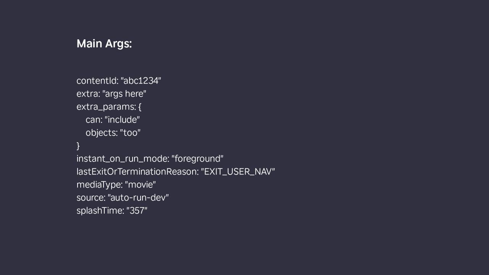

# Update Main Args (Brighterscript Plugin)

[](https://github.com/markwpearce/bsc-plugin-update-main-args/actions?query=branch%3Amaster+workflow%3Abuild)

<!--
[](https://coveralls.io/github/markwpearce/bsc-plugin-update-main-args?branch=main)
-->

A [Brighterscript](https://github.com/rokucommunity/brighterscript) plugin that injects properties into the argument of the main function - useful for adding [deep links](https://developer.roku.com/en-ca/docs/developer-program/discovery/implementing-deep-linking.md) for debugging, for example.

**NOTE: Only Supports Brighterscript Version 1**

It works by injecting a single line of code as the first line the [`main()`](https://developer.roku.com/en-ca/docs/developer-program/getting-started/architecture/dev-environment.md#sub-main) (or [`runUserInterface()`](https://developer.roku.com/en-ca/docs/developer-program/getting-started/architecture/dev-environment.md#sub-runuserinterface)) function , like this:

```brs
sub main(args)
    args.append(parseJson("{""extra"":""args here""}"))
    ...
end sub
```

## Usage

In a Brighterscript project, install the plugin:

```sh
npm install -D bsc-plugin-update-main-args
```

Add it to the plugins list in `bsconfig.json`, and set up the arguments to load:

```json
{
    "plugins": ["bsc-plugin-update-main-args"],
    "updateMainArgs": {
        "args": {
            "mediaType": "movie",
            "contentId": "test-1234"
        }
    }
}
```

## Read Args from .env

This plugin can also read arguments from an `.env` file (or from your system's environment variables).

Create a `.env` file with the variable `MAIN_ARGS`. It should be in JSON format:

```env
MAIN_ARGS={"mediaType":"movie","contentId":"test-1234"}
```

Change the `bsconfig` options to load the environment variable:

```json
{
    "plugins": ["bsc-plugin-update-main-args"],
    "updateMainArgs": {
        "useEnv": true,
        "envFilePath": ".env"
    }
}
```

## Full Configuration Options

```jsonc
{
    "updateMainArgs": {
        "useEnv": true, // read environment variable
        "envFilePath": ".env", // path to specific .env file to read
        "envVar": "MAIN_ARGS", // The environment variable to read
        "args": {} // Just add args directly
    }
}
```

## Example App

There is an test app showing how the plugin works in `./testapp` (with the caveat that it is loading the plugin directly from source instead of through npm).

You can run the test app through VSCode:

1. `npm install` to install all dependencies
2. Open VSCode, run debug configuration `Debug Test App`

It will display all the arguments that werethe following screen:



Test App configuration (`./testapp/bsconfig.json`):

```json
{
    "updateMainArgs": {
        "useEnv": true,
        "envFilePath": "./testenv",
        "args": {
            "extra": "args here",
            "extra_params": {
                "can": "include",
                "objects": "too"
            }
        }
    }
}
```

Environment variables file (`./testapp/testenv`):

```env
MAIN_ARGS={"mediaType":"movie","contentId":"abc1234"}
```
